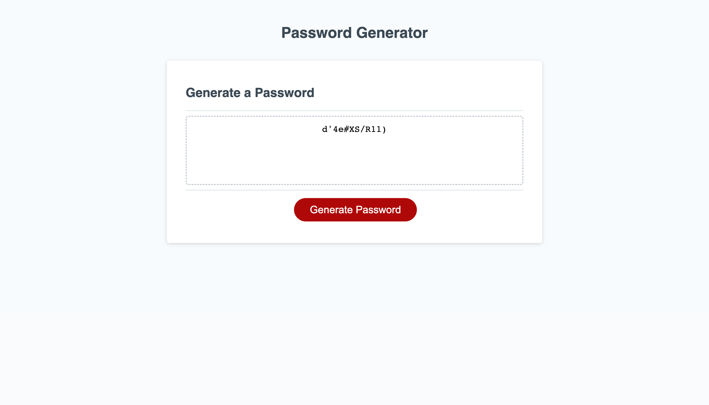

# password-generator

## Description

This repository was created to create an application that the user can use to generate a random password based on criteria they’ve selected

## Usage

Press the button "Generate Password", provide the length of needed password, answer few more questions and the newly generated password will appear in the box instead of the text "Your Secure Password"

## Link

https://1eva1987.github.io/password-generator/

## License

MIT license
